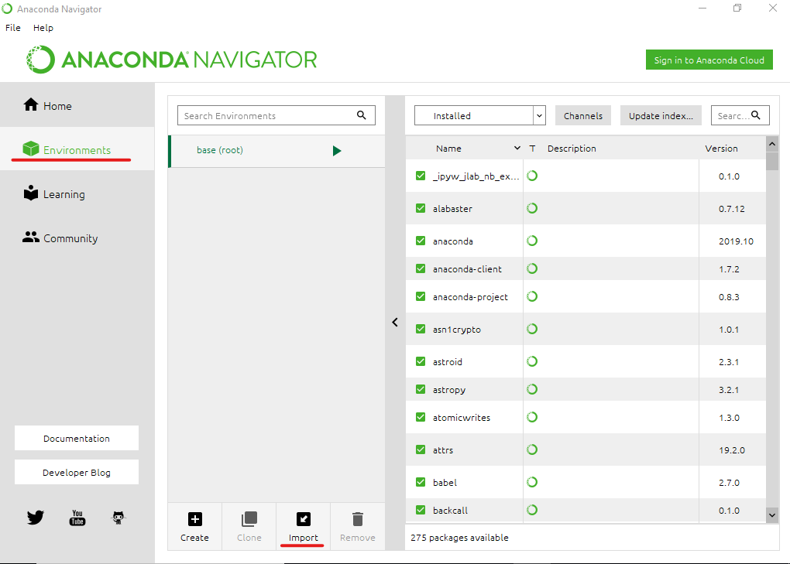

# Running Jupyter on your computer

Running a Jupyter notebook on your own computer is the recommended way to compute in the course. Here are the steps to get up and running:

## Setup

- Download and install the [Anaconda Python](https://www.anaconda.com/distribution/#download-section) distribution for your operating system (pick the Python 3.8 version, 64 bits). The full install will take a few minutes.

- Download [the ydata123_env.yml specification file](ydata123_env.yml), which defines the packages and libraries you need to run class exercises and homework.

- Start up the application called Anaconda Navigator, which should have just been installed. Choose the Environments tab on the left, then the import button at the bottom. Choose the `ydata123_env.yml` file as your specification file in the popup dialog and click import.

## Running

- After the environment is finished installing you should have everything you need. Each time you re-open Anaconda Navigator be sure to click the environments tab and click on ydata123 to switch to this environment. **Important**: Don't update packages even if Anaconda tells you it can. Changing versions during the semester might make certain exercises stop working!

- From the home tab in Anaconda Navigator, click the launch button under Jupyter notebook. This should open a Jupyter session in your default browser.

- Download and extract the current version of the class materials from [https://github.com/YData123/sds123-sp21](https://github.com/YData123/sds123-sp21). Navigate to this folder on your computer in the Jupyter file browser, then click the notebook file you want to run.
